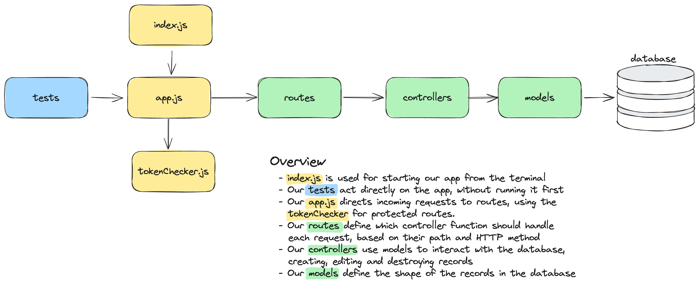

# Backend Structure

The backend of this project can be found in the `api` directory.

It consists of a few parts. This page will go some way to explain the different
parts, and how they fit together.



## Contents
- [index.js](#indexjs)
- [app.js](#appjs)
- [routes](#routes)
- [controllers](#controllers)
- [models](#models)
- [middleware](#middleware)
- [lib](#lib)
- [db](#db)

### index.js

This is the file we run when we want to start our server. It does two things:

1. Connect to the mongodb database.
2. Start our app, listening for incoming HTTP requests.

### app.js

This file is where we create our application, using the framework Express. It
does a few things:

1. Configures our application, setting up CORS settings, and making it so
   request bodies are automatically parsed.
2. Sets up our api routes at `/users`, `/posts` and `/tokens`, through the use
   of routers.
3. Sets up a 404 handler, a default response if a request has a nonexistent
   route.
4. Sets up an error handler, so that if something goes wrong in our application,
   the whole thing doesn't crash.

### routes

Our routes define the different request URLs that our api will respond to. They
also define which controllers will handle which requests.

We can create a router, and use it in `app.js`, and the resulting endpoint URL
will be the combination of the two. So for example if we have this router:

```js
const usersRouter = express.Router();
usersRouter.get("/all", UsersController.getAllUsers);
```

and the router is used like this:

```js
app.use("/users", usersRouter);
```

The resulting endpoint url will be `/users/all`, and requests to this endpoint
will be handled by the `UsersController.getAllUsers` function.

We an also include _parameters_ in our routes. So if we have a route:

```js
usersRouter.get("/find/:id", UsersController.getSingleUser);
```

Then requests to `users/find/abcdef123456` will be handled by the
`UsersController.getSingleUser` function. The id itself can then be accessed in
the controller through the `req.params.id` object.

```js
console.log(req.params.id); // => abcdef123456
```

### controllers

Controllers contain the functions that actually handle the requests that our app
recieves. Each controller has a `req` and `res` argument, which are objects
representing the request that comes in, and the response we send back
respectively.

We can access details of the request such as `req.body`, `req.method` (GET, POST
etc.), `req.params`, `req.query`. The full list can be found
[here](https://expressjs.com/en/api.html#req).

We can also add data to the `req` object with _middleware_, such as the
`tokenChecker` adding the `req.user_id` property, which can then be used by
controller functions.

The `res` object is how we respond to requests. This can be with
`res.send("Some response")` or `res.json({ some: "response" })` to send a JSON
object. There are also other useful methods available, such as `res.status` for
setting the status of the response (eg. 201, 403, 500), and `res.redirect` for
redirecting requests to other endpoints. The full list can be found
[here](https://expressjs.com/en/api.html#res).

### models

Our models are classes that handle interaction with the database. We create our
models using a library called Mongoose. Each model is created with a
[_schema_](https://mongoosejs.com/docs/guide.html), which defines the shape of
the data in the database, ie. what fields the entries in our database have.

The models we create have a number of built-in methods, such as `.find()`,
`.findOne()` and `.countDocuments()`. The full list can be found
[here](https://mongoosejs.com/docs/api/model.html).

To create entries in the database, we can use the `new` keyword, and the `.save`
function:

```js
const newPost = new Post({ message: "This is a new post" });
await newPost.save();
```

Similarly, to edit an entry, we can use `.find` and `.save`:

```js
const existingPost = await Post.find({ message: "This is an existing post" });
existingPost.message = "This is an edited post";
await existingPost.save();
```

All interaction with the database (fetching entries or saving them) is
asynchronous, so must be used with `await` or a callback.

### middleware

Middleware are similar to our controller handler functions, but don't
necessarily end with a response. Instead they call a `next` method to pass on to
the next handler.

For example, the `tokenChecker` middleware makes sure that the request has been
sent with a vaild token. If it has, it passes on to the next handler, such as
the posts router. If it has an invalid token, it will send an error response
back to the client.

`app.js` also uses a couple of third-party middlewares, `cors` and `bodyParser`,
which you can look up if you are interested.

### lib

The lib directory simply contains functions which can be used from anywhere in our
app. This template starts with a single file in lib, containing functions for
encoding and decoding tokens. This function is used by both the `tokenChecker`
middleware, and in our tests.

### db
This directory contains functions related to interaction with the database. It currently contains one file, which connects to the database based off of the `MONGODB_URL` environment variable.