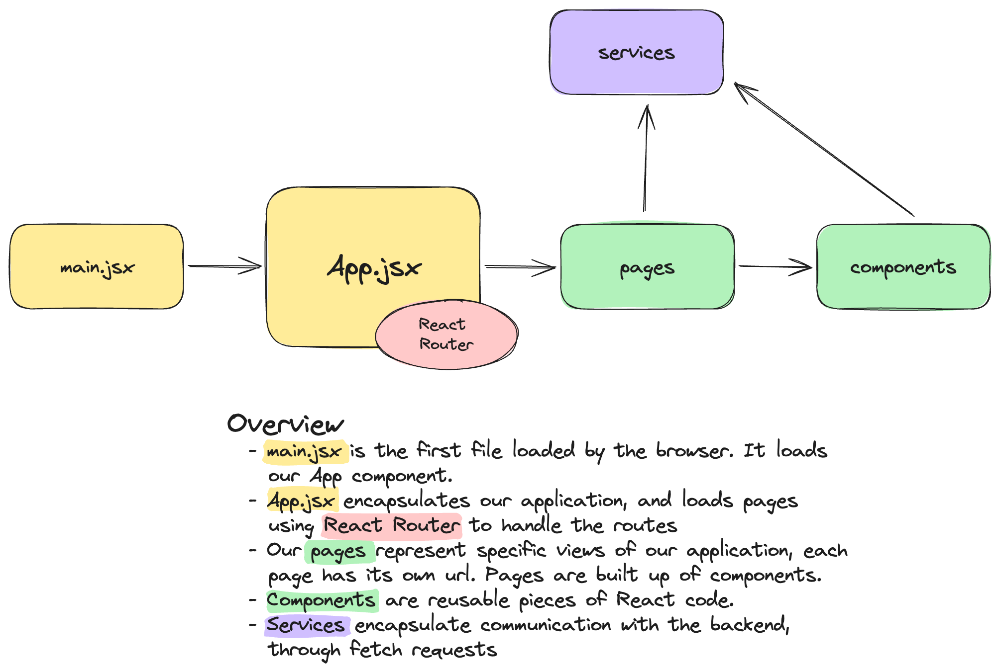

# Frontend Structure

The frontend of this project can be found in the `frontend` directory.

The front end of this project is a React application, which uses Vite to handle
scaffolding, a dev server, and building for production.

## Contents

- main.jsx
- App.jsx
- pages
- components
- services
- assets

### main.jsx

This is the file which joins the initial HTML document with the React
application. It finds a div in the HTML that has an id of `root`, and uses React
to insert our App into that div.

### App.jsx

This file contains our application. It imports all of the pages we want in our
application, and uses React Router to serve them at specific URLs. Unlike
previous web applications you may have worked on, these different URLs don't
represent different backend routes. They are handled purely by the frontend. Any
request to any of these routes will be served the same HTML and JS files for the
React application, and the application will then determine how to handle the
route.

### Pages

Pages represent individual views of our application. Such as the login page or
the feed page. They are built up of smaller components, and may interact with
the backend through services.

### Components

Components represent smaller, reusable pieces of code. They can be _atomic_
components, which are not usable on their own, or more complex components made
up of other components. They can hold their own state, if useful. They may
interact with the backend through services.

### Services

Services encapsulate communication with the backend, through HTTP requests. They
make our code easier to read and understand, by abstracting the complexity of
the `fetch` requests into their own functions, so they don't clutter our
components.

### Assets

Assets are static, non-code resources, such as images, sound files etc.
